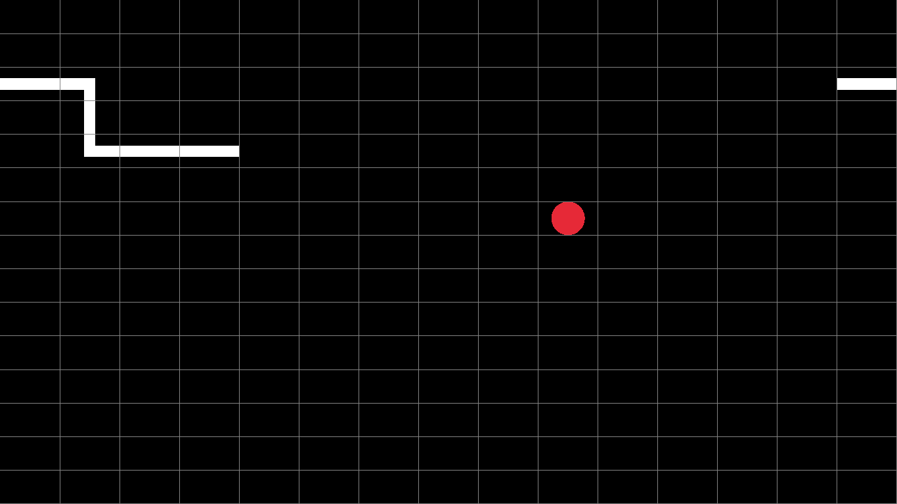

# Snake Game

Snake game using [raylib](https://github.com/raysan5/raylib)



## Building

### Requirements

Game Library - [raylib](https://github.com/raysan5/raylib) \
C++ Wrapper - [raylib-cpp](https://github.com/RobLoach/raylib-cpp/tree/master) \
Builder - [CMake](https://cmake.org)

### Steps

```bash
git clone (this repo) SnakeGame
cd SnakeGame

cmake -S . -B build
cd build && make
cd ..
```

Then run the `bin/SnakeGame` executable.
